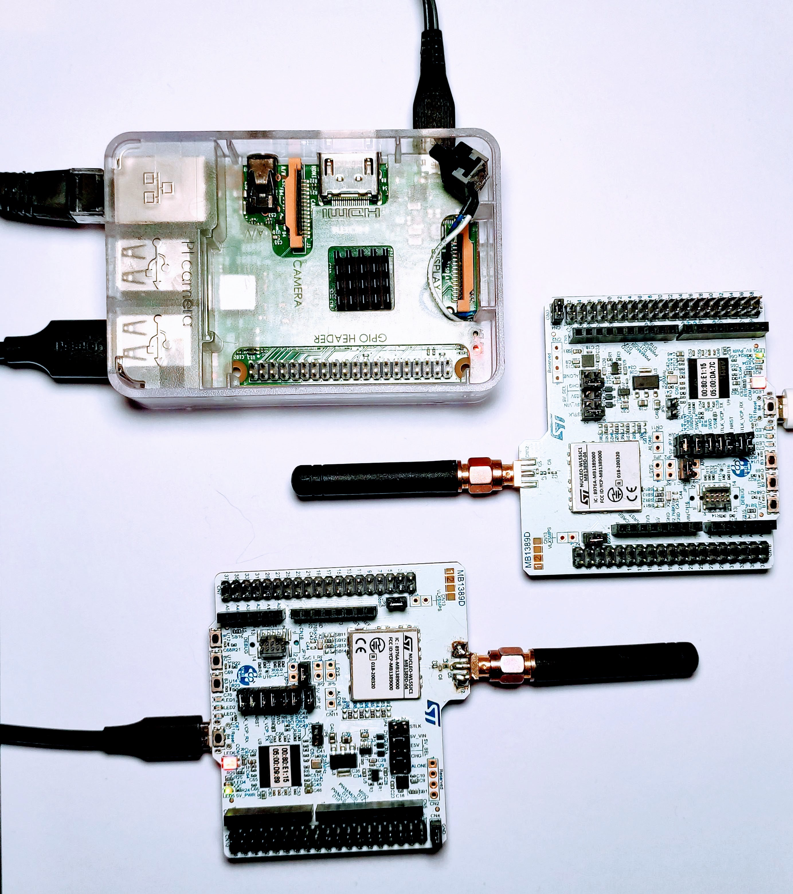
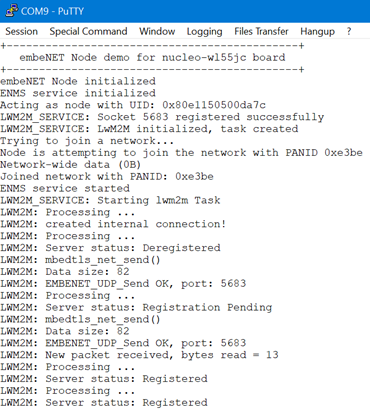
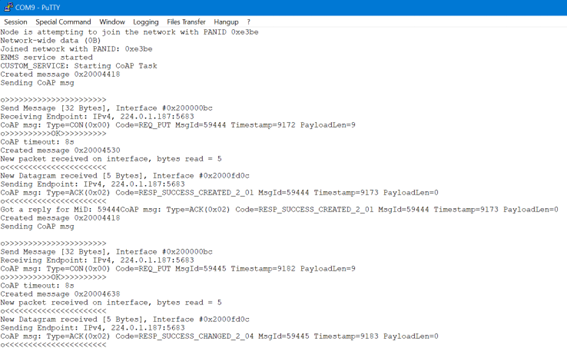

# MQTT-SN, COAP and LwM2M protocols implementation
## for STM32 EmbeNET Node network

  
  
  

###### Objective of the Work:
- Review, implement, and analyze the use of application layer protocols in IoT devices built on ARM Cortex-M microcontrollers.
- Focus on usability in resource-constrained, low-throughput wireless mesh networks typical of IoT systems.
- MQTT, CoAP, and LwM2M were chosen for their diversity, popularity, and compatibility with the UDP transport protocol.
- The study utilized the embeNET wireless mesh network and the NUCLEO-WL55JC1 evaluation board.

###### Project physical components
- STM32 NUCLEO-WL55JC1 development boards
- Raspberry Pi with Linux for testing purposes

###### Tech Stack
- C programming language
- EmbeNET Node Networking Stack (WSN, UDP, 802.15.4e-TSCH)
- STM32 Microcontrollers
- MQTT-SN, CoAP and LwM2M Application Protocols
- Wireshark, Build Analyzer, Linux Protocol Servers and other testing environment

###### Implementation
The STM32CubeIDE project, hosted in the repository, includes the implementations of all three tested protocols. The MQTT-SN service is integrated into the EmbeNET system by default. For this project, I implemented and utilized the LobaroCoAP and WakaamaNode libraries.

###### Additional Links
Project presentation [Google Slides](https://docs.google.com/presentation/d/1Z-rlvH5L5WxhMZ4jai3aUcdPBF50T83Pxhtv7MIKrZg/edit?usp=sharing) [PL] (20.09.2024) 

Master's thesis with detailed project description [Google Drive](https://drive.google.com/file/d/1baA6rWexkmiFCm8SGg68tbLzjkFmJ3Kp/view?usp=sharing) [PL] 

###### About project
- **Developer and owner: Miłosz Janik**
- Made for Diploma Thesis - Master degree - "Application layer protocols for IoT devices using wireless connectivity and the UDP transport protocol."
- Thesis promoter: PhD Łukasz Krzak
- Field of study: Electronics and Telecommunications (Embedded Systems specialization)
- Status - Diploma thesis defended
